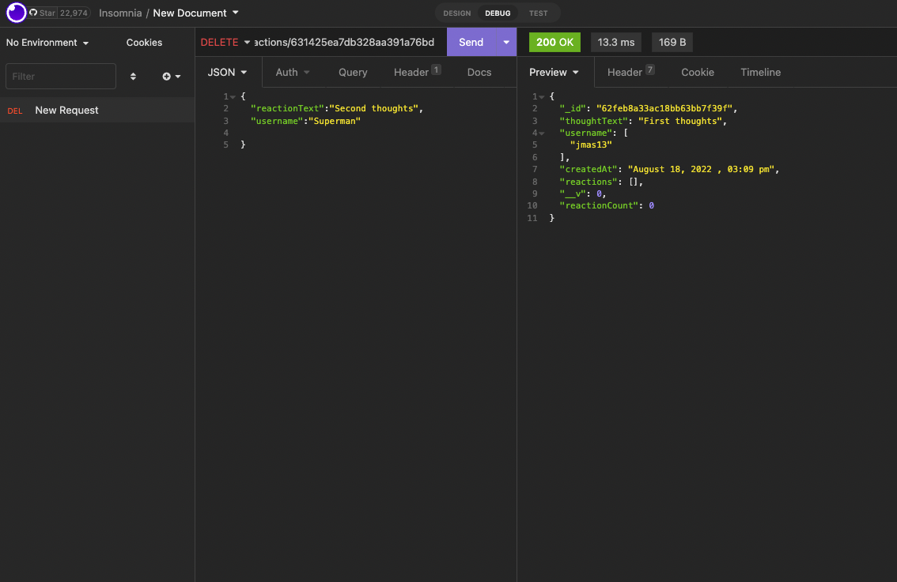

# NoSQL Social Network API

## Description

A basic social media API back-end allowing users to add friends and thoughts and react to their friends thoughts. This app utilizes MongoDB and IDB to run. As this is back-end only, this program is not deployed.

## Instructions
Open the code in VSCode or another code editing program. Open terminal and enter "NPM Install" and then "NPM Start to start the app's server. This is a back-end only program so you will need Insomnia in order to see the routes work.

## User Story

```
GIVEN a social network API
WHEN I enter the command to invoke the application
THEN my server is started and the Mongoose models are synced to the MongoDB database
WHEN I open API GET routes in Insomnia for users and thoughts
THEN the data for each of these routes is displayed in a formatted JSON
WHEN I test API POST, PUT, and DELETE routes in Insomnia
THEN I am able to successfully create, update, and delete users and thoughts in my database
WHEN I test API POST and DELETE routes in Insomnia
THEN I am able to successfully create and delete reactions to thoughts and add and remove friends to a user’s friend list
```
## Screenshot
[Click here to see a full video walkthrough of the app's functionality](https://drive.google.com/file/d/1gm6DJWLbirU2QYWL4glB_ozOBrWSVimc/view)



## Links

Repo: https://github.com/JimMason564/Social_Network_API

